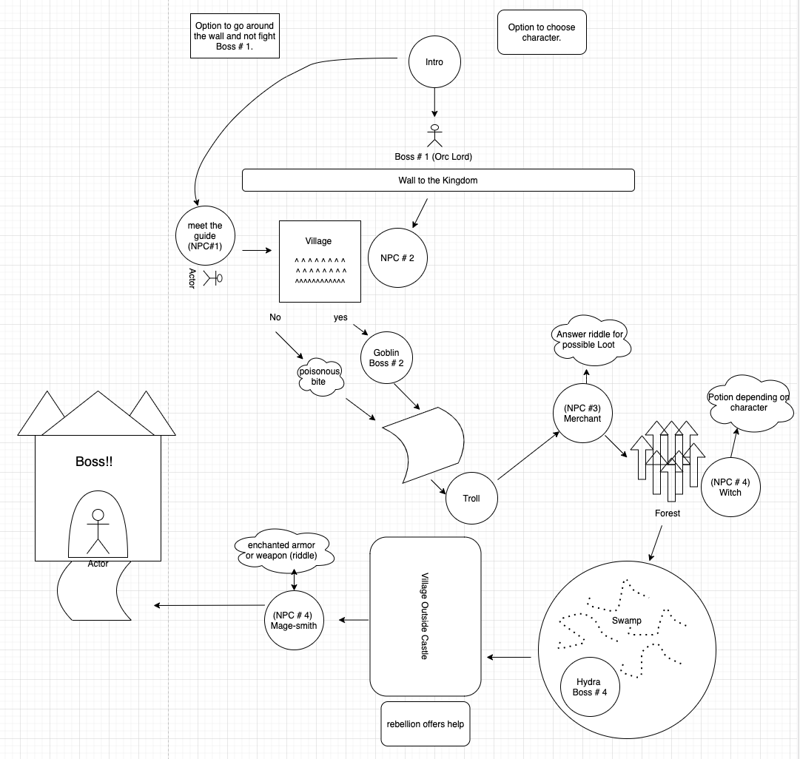

# CODE HEROS QUEST: battle-for-the-kingdom

## Midterm project

Description of scope of project

Today we are spoiled for choices when it comes to computer entertainment. We have games consoles like the XBOX and Playstation offering up 4k hyper-real graphics with immersive sound sitting under our TV sets. We also have virtual reality experiences that immerse us entirely in graphics and sound with headsets, augmented reality where we overlay graphics onto the real world, and we have mixed reality with headsets likes the Halolens. These are all well and good, but we can go even higher resolution using the most powerful graphics engine ever invented; your imagination!

With that, I present this game engine called the “Code Heroes Quest.” Ever since Humans could communicate in writing, we have been using the power of the written word to tell stories and fire up the imagination. Back in the 1980s making fiction more interactive was popularized with text adventure computer games where you get to play and explore a virtual world purely through text on the screen. At the time computers were very underpowered and could not display lots of graphics, but as graphic based computer games became more popular the humble text adventure started fading into the background, but they never went away, and there are still a lot of people who enjoy playing them as well as making them.

The Code Heroes Quest is an easy to use, object-oriented game framework The engine is developed in Javascript, Node.js; which means games can be played in the console window.

# Developers: 

- Michael Eclavea
- Spencer Lazzer
- Czarl Jalos
- Sara Russert

# Feature Tasks

# System Requirements 
- [requirements](./requirements.md)

# User Stories

+ as a user i want to play games 
+ as a user i want to play games with my friends 
+ as a user i would like the option to play not only in person but online with my friends 
+ as a user i would like to play a retro text based game
+ as a user i want to escape my every day normal life by playing an adventure game!

*Stretch*: As a user, I want several option to display my custom name.
+  Feature task: add a function that store customized player name.
*Stretch*: As a user, I want option to pick up loot to enhance my chance to finish the game.
+  Feature task: a form of feature that gives reward boss is defeated.
*Stretch*: As a user, I want mini game that will increase the interaction of players.
+  Feature task: create a function that  send out riddle to the players to answer.

### What is the vision of this product? 

To produce a online game for players that likes to go back in time and experience adventure text based game.

### What pin point does this project solve?

Defeat boredom and increase friends bonding that covid-19 causes.

### Why should we care about your product?

+ Object Oriented Design that puts you in control of scenarion and a riddle game.
+ Navigation around rooms that are linked together.
+ Inventory system for collection objects in the game.
+ Ability to collect objects loot from npc and bosses.

## Functional Requirements

+ Retro Based Adventure Game
+ Riddle Game

# Visual aids
